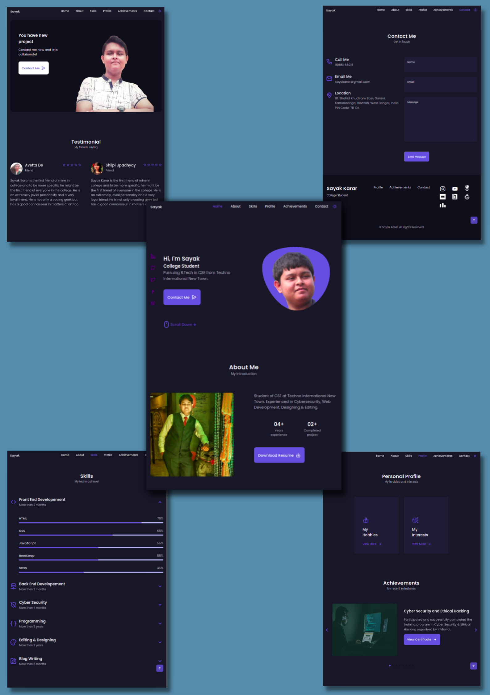

# Portfolio Website

This is full stack web application development project to create a responsive and dynamic portfolio website of a person including qualifications, skills, achievements, personal profile and contact details.

## Authors

- [@Sayak-Karar-2581](https://www.github.com/Sayak-Karar-2581)

  
## Tech Stack

**Client:** HTML, CSS, Javascript, Swiper JS 

**Server:** Flask (Python), MySQL (Database)

  
## Features

- Light/dark mode toggle
- Typing Text Effect
- Accordion display section
- Modal display section
- Caraousel display section
- Dynamic contact form
- Responsive website

  
## Preview

Light Theme

Dark Theme

  
## Try it yourself

https://sayak-karar-portfolio.herokuapp.com/

  
## Feedback

If you have any feedback, please reach out to me at sayakarar@gmail.com

  
## Acknowledgements

 - Coding Club of Techno International New Town
 - Twinkle Chatterjee
 - Shourya Gupta
 - Vishal Kumar Sharma
 - Aniket Pal
 - Avetta De
 - Raisa Alam

  